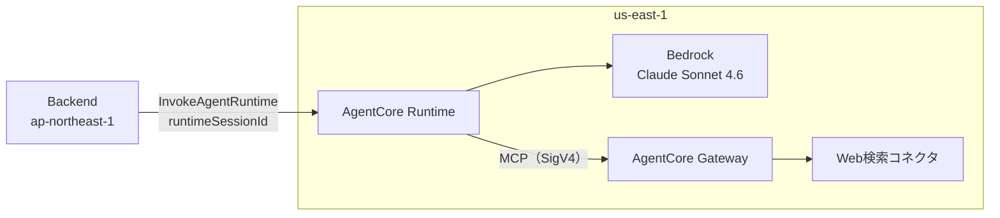

# Agent の設計

Agent は会話の司令塔で、会話の保持・回答の生成・Web 検索・周辺の場所の検索を担う。Bedrock AgentCore の Runtime で動く Strands のエージェント。
全体の方針は [docs-parent/01_technical_policies.md](../docs-parent/01_technical_policies.md)、Backend との約束は [docs-parent/03_units_contracts.md](../docs-parent/03_units_contracts.md)（UC-2・UC-3・UC-5）。

| | |
|---|---|
| リージョン | `us-east-1` |
| IaC | CDK（`agentcore` CLI が `agentcore/agentcore.json` から生成する） |
| Runtime | `agentcore_trg_dev_ask`（CodeZip・Python・`app/agentcore_trg_dev_ask/`） |
| Gateway | `gwTrgDevMain`（MCP・IAM 認証。Web 検索のコネクタを持つ） |

## 1. 構成



| ファイル | 役割 |
|---|---|
| `main.py` | エントリポイント。システムプロンプト、セッションごとのエージェント、応答のストリーム |
| `model/load.py` | Bedrock のモデルの設定（モデル ID・`max_tokens`） |
| `tools/web_search.py` | Gateway への MCP クライアント |

## 2. リージョンとモデル

- Web 検索のコネクタ（Gateway の組み込み）が us-east-1 にしか無いので、Runtime と Gateway を分けずに Agent ごと us-east-1 に置く。
- モデルは推論プロファイルの ID で指定する（`us.anthropic.claude-sonnet-4-6`）。このアカウントの Anthropic のモデルは推論プロファイル経由でしか呼べない。
- ⚠️ `jp.` のプロファイルは ap-northeast 専用で、us-east-1 から呼ぶと `The provided model identifier is invalid` になる。CLI が生成する既定の ID も、このアカウントでは呼べない。
- モデル ID・リージョン・`max_tokens` は環境変数（`BEDROCK_MODEL_ID`・`BEDROCK_REGION`・`BEDROCK_MAX_TOKENS`）で変えられる。

## 3. 会話の継続

- AgentCore は `runtimeSessionId` からセッション ID を渡し、Agent はセッション ID ごとにエージェント（会話の履歴）をプロセス内に持つ。
- 履歴は `SlidingWindowConversationManager` で直近 `MAX_TURNS`（既定20ターン≒10往復）まで。毎回 Bedrock に再送されるので、入力トークンの量を直接決める。
- 同時に保持するセッションは128まで（古いものから捨てる）。
- 履歴はセッションの microVM が生きている間だけ残る。コールドスタートやアイドルのタイムアウトで消え、会話は黙って最初からになる。要件は「一問一答＋α」までなので、これで足りる。
- セッションを越える記憶（AgentCore Memory）は使わない（経緯は親の [adr/002](https://github.com/h-akira/TouringProject/blob/main/adr/002_agentcore_as_orchestrator.md)）。

## 4. 調べる道具（Web 検索・周辺の場所）

### Web 検索

- AgentCore Gateway の組み込みコネクタ（`connectorId: "web-search"`）を MCP で呼ぶ。AWS が運用する索引なので、第三者の API キーを持たずに済む。
- Gateway は IAM で認可し、リクエストは Runtime の実行ロールで SigV4 署名する。実行ロールに `bedrock-agentcore:InvokeGateway` が要る（無いと AccessDenied）。
- Gateway の URL は CLI が注入する環境変数（`AGENTCORE_GATEWAY_<NAME>_URL`）から読む。名前ではなく接頭辞で探すので、Gateway の名前を変えても検索が黙って止まらない。手元では `GATEWAY_URL` で上書きできる。
- Gateway が無いときは検索なしで答える（モデルの知識だけ）。手元の開発も Gateway 無しでできる。

### 周辺の場所（`tools/places.py`）

「右手に見える公園は？」「一番近いマクドナルドは？」に答える。Amazon Location Service（`geo-places`）を Runtime と同じ us-east-1 で直接呼ぶ。

| ツール | API | 使う場面 |
|---|---|---|
| `search_nearby_places` | `SearchNearby` | 種類で探す（公園・山・コンビニ・ガソリンスタンド等。LLM は決まった選択肢から選ぶ） |
| `search_places_by_name` | `SearchText` | 名前で探す（マクドナルド・ENEOS・芦ノ湖等） |

- 座標と進行方位は、ペイロードの `location`（UC-5）を Strands の `invocation_state` 経由で読む。LLM の引数にはしない（LLM は座標の書き写しを誤る）。
- 距離・方角・左右（前方・右前方・右手・右後方・後方・左後方・左手・左前方の8方向）はツールのコードで計算し、文字にして LLM に返す。LLM には計算させない。進行方位が無いときは左右を付けない。
- 失敗は例外にせず文で返す（「現在地が分からないため…」「検索に失敗しました」）。回答そのものは止めない。
- ⚠️ 地図のデータの位置は誤っていることがある（数km先の山が駅のそばにある等）。システムプロンプトで断定しすぎないよう指示する。
- 実行ロールに `geo-places:SearchNearby`・`SearchText` が要る。`agentcore.json` に書く項目が無いので `cdk/lib/cdk-stack.ts` に足している（§7）。
- カテゴリ ID の実測: https://github.com/h-akira/TouringProject_Research/blob/main/geocoding/FINDINGS.md

## 5. システムプロンプトの方針

回答は走行中に読み上げられ、ライダーは画面を見られない。システムプロンプト（`main.py` の `SYSTEM_PROMPT`）は次を指示する。

- 2〜3文で簡潔に答える。前置きや復唱をしない。Markdown の記号を使わない（読み上げると不自然）。
- 日付と時刻は、質問に添えられた【現在日時】を正とする（検索結果の新旧もこれで判断する）。
- 方角や左右は与えられたとおりに使い、計算し直さない。進行方向が無いときは方角や左右に触れない。
- 「いま右手に見える」なら最新の位置を、「さっきの山」ならその話題が出たときの位置を使う。
- 「アプリで確認してください」とは答えず、自分で検索する。天気・道路状況・営業時間・イベントなど、その日その時の情報は必ず検索する。変わらない知識は検索しない。
- 検索するときは、現在地から都道府県名と市町村名を補って具体的に書く。
- 周辺の具体的な場所は、Web 検索ではなく周辺の場所のツールで探す。ツールが返す距離・方角・左右はそのまま使う。地図のデータはずれることがあるので断定しすぎない。
- 山・駅・都市など特定の場所の方角や距離は、有名な場所でも知識で答えず、名前で探すツールで調べる（千葉から富士山のように遠くてもよい）。
- 質問は音声認識の文字起こしなので、誤変換（公園→講演）や聞き間違い（温泉→音声）を疑い、文脈に合う語として解釈する。
- 分からなければ分からないと答える。作り話をしない。

住所・方位・日時を確定するのは Backend の仕事で、Agent はそれを受け取るだけ（UC-5）。

## 6. `max_tokens`

既定は800（`model/load.py`）。読み上げる回答の長さを縮めるのはシステムプロンプトの役目で、`max_tokens` は暴走への歯止めにすぎない。

- ⚠️ 厳しすぎると、回答が短くなるのではなく途中で切れて `MaxTokensReachedException` で失敗し、壊れた部分応答が会話の履歴に残る（同じセッションで失敗が続く）。300 では実際に当たった。
- ⚠️ Web 検索のツール呼び出しと検索語も同じ枠を消費する。2回検索する質問は、直接答える質問より多くを使う。

## 7. ツールの足し方

拡張はツールを足す形で行う。メモ機能（US-X.01）は次のようなツールを足すだけで入れられる構造を保つ。

```python
@tool
def save_memo(text: str) -> str:
    """ライダーのメモを保存する"""
```

- ツールは `tools/` に置き、`main.py` で `Agent(tools=[...])` に渡す。
- Gateway 経由のツールを足すときは `agentcore/agentcore.json` に書き、CLI で反映する（`cdk/` の生成コードを直接いじらない）。
- 例外は Runtime の実行ロールに足す権限だけ。`agentcore.json` に項目が無いので `cdk/lib/cdk-stack.ts` に書く（いまは周辺の場所の `geo-places`）。`cdk/` は最初に CLI が生成した雛形で、`agentcore deploy` は作り直さないので残る。⚠️ `cdk/` を作り直すときはこのブロックを移す（消えるとデプロイは成功し、周辺の検索だけが権限エラーで「失敗しました」と返る）。
- 手元で通しの確認をするときは `scripts/ask_local.py` を使う（README）。本物の LLM とツールで、Backend と同じ形のプロンプトとペイロードを送る。

## 8. 応答とログ

- 応答は Strands のモデルのイベントだけを SSE で返す（SDK の管理用の dict は返さない）。ペイロードに質問が無いときは `{"error": ...}` を返す。
- ログには質問の本文だけを出す（Backend が先頭に付ける日時・座標・住所のブロックは出さない）。`質問: ` の最後の出現で分ける。

## 9. コスト

- AgentCore はアイドル中も課金される（文脈を保つため microVM が生きている）。ツーリングは散発的な質問なので、影響は要実測。
- 初回の応答は10秒前後（コールドスタート）、2回目以降は2〜3秒。
